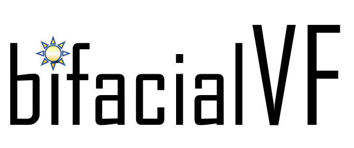

# Bifacial PV View Factor model

keywords: python, configuration factor model, electrical model mismatch for bifacial modules.

## Introduction

bifacialvf is a self-contained view factor (or configuration factor) model which
replicates a 5-row PV system of infinite extent perpendicular to the module
rows. The function returns the irradiance profile along the middle (interior)
row by default, but user interface options include `'first'`, `'interior'`,
`'last'`, and `'single'`. Single-axis tracking is supported, and hourly output
files based on TMY inputs are saved. Spatial nonuniformity is reported, with
multiple rear-facing irradiances collected on the back of each module row.

Bilinear interpolation code add-on to bifacialvf (description below) to pre-generate IV arrays and bifacial coefficients, and to examine the energy production with back side irradiance mismatch for either a portrait or landscape module.   
Included are IV curves and bifacial info for a Yingli (standard) module. 

## Pre-requisites
This software is written for Python 2 or 3. NREL recommends [Anaconda Python](https://www.anaconda.com/download/).

## Install using pip
[bifacialvf](https://pypi.org/project/bifacialvf/) is at the Python Package Index (PyPI). Use pip to install the latest release in your conda environment or virtualenv:

    (myenv)$ pip install bifacialvf

### Install development mode from GitHub
For those interested in contributing to bifacialvf:

1. Clone the bifacialvf repository: `$ git clone https://github.com/NREL/bifacialvf.git bifacialvf-main`
2. Navigate to the repository directory where `setup.py` is located: `$ cd bifacialvf-main`
3. Install via pip in development mode: `$ pip install -e .`

## Usage

For usage examples, see the Jupyter notebooks in \docs\

## License
bifacialvf open source code is copyrighted by the Alliance for Sustainable Energy and licensed with BSD-3-Clause terms, found here.

## Citing bifacialVF

If you use bifacial_radiance in a published work, please cite:

    Marion, B., MacAlpine, S., Deline, C., Asgharzadeh, A., Toor, F., Riley, D., … Hansen, C. (2017). A Practical Irradiance Model for Bifacial PV Modules: Preprint. In 44th IEEE Photovoltaic Specialists Conference. Washington, DC. https://www.nrel.gov/docs/fy17osti/67847.pdf. NREL/CP-5J00-67847

Please also cite the DOI corresponding to the specific version of bifacial_radiance that you used. bifacial_radiance DOIs are listed at [Zenodo.org](https://zenodo.org/search?page=1&size=20&q=conceptrecid:3860349&all_versions&sort=-version)

Bilinear Interpolation based on the publications:
    De Soto, W., Klein, S. A., & Beckman, W. A. (2006). Improvement and validation of a model for photovoltaic array performance. Solar Energy, 80(1), 78–88. https://doi.org/10.1016/j.solener.2005.06.010

    Marion, B., Rummel, S., & Anderberg, A. (2004). Current--voltage curve translation by bilinear interpolation. Progress in Photovoltaics: Research and Applications, 12(8), 593–607.

bifacialvf: Original code by Bill Marion, Python translation by Silvana Ayala, Updates by Chris Deline & team
Original bilinear interpolation code by Sara MacAlpine, Python translation & Updates by Silvana Ayala
PVMismatch add-on: PVmismatch code from [PVMismatch](https://github.com/SUNPower/PVMismatch), by Sunpower

